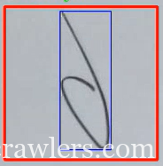

# 손글씨 숫자 인식을 이용한 보안 인증 시스템 구현 #

## 요약 ##

- 컴퓨터 비전을 활용하여 사용자가 쓴 숫자 그림 4개를 인식하고 패스워드를 검증하는 시스템입니다.

- 입력 (Input): 웹캠으로 손글씨를 4회 캡처합니다. 사용자 편의를 위해 화면에 사각형 가이드라인을 제공합니다.

- 판단 (Logic): 사전에 학습된 파라미터(DNN)를 로드하여 입력된 이미지가 어떤 숫자인지 인식합니다.

- 결과 (Security): 성공 시 특정 메시지 생성. 키보드나 정전식 터치패드 없는 단말장치를 위한 인증 시스템을 설계하였다.

--------------------------

--------------------------

## 파일 및 관련 문서 ##

[다운로드](https://github.com/jalanwang/OpenCV_Project02/tree/auto_read2) (Linux)

[개발 줄거리](https://coffeecrawlers.com/?p=2176)

[발표 자료](https://docs.google.com/presentation/d/1O1eV30sE_yvFdGf-2JSo2zs8kUxJ350yqFcQG4SBz8s/edit?usp=sharing)

[LICENSE](https://www.olis.or.kr/license/Detailselect.do?lId=1002): Apache2

## Release ##

v1.0.0  2026. 1. 14 바운딩 박스와 인식영역의 비율을 두어서 안정적으로 이미지를 획득할 수 있게 되었다.
v1.0.1  2026. 1. 16 바운딩 박스 안의 문자를 정중앙으로 이동해서 저장하는 기능을 추가하였다.
